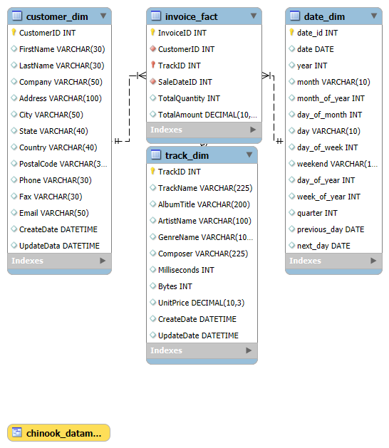

# Chinook Data Warehouse (OLAP + Data Mart)

### 🧠 Overview
This project demonstrates the implementation of an OLAP Data Warehouse using the Chinook dataset for the fictional company **MusicRhythm**.  
It includes schema modeling, dimension creation, fact table design, and a BI-ready Data Mart view.

---

### ⚙️ Key Components
- **Customer_Dim:** Contains customer details with SCD1 strategy.
- **Track_Dim:** Denormalized track, artist, album, and genre data.
- **Date_Dim:** Generated using a stored procedure for time-based analysis.
- **Invoice_Fact:** Combines sales data from invoices and details, linked to all dimensions.
- **Chinook_Datamart View:** Business Intelligence-ready view joining all tables.

---

### 🧩 Files
| File | Description |
|------|--------------|
| `CHINOOK_OLTP_clean.sql` | Original OLTP structure and data |
| `chinook_olap.sql` | OLAP schema creation and inserts |
| `MYSQL_DATE_DIM_EXTEND.sql` | Date dimension generation script |
| `chinook_star_schema.png` | Star schema diagram |
| `jeiya_assign_starschema_ER_diagram.mwb` | MySQL Workbench model file |

---

### 💡 Tools Used
- MySQL Workbench  
- SQL Scripts  
- ER Modeling  
- OLAP & Data Mart Concepts  

---

### 🧾 Description
The project focuses on transforming OLTP data into an OLAP structure for reporting and analysis.  
Implemented with **SCD1** strategy and delivered as a **Star Schema** for simplicity and clarity.

---

### 📊 Schema Diagram

